# Omnisense - See the Future.

> *Everyone wishes they could go back and buy Bitcoin at $1. Omnisense brings the future to you, so you never have to wonder "what if?" again.*

**⚠️ NOT FINANCIAL ADVICE** | Omnisense provides analysis for entertainment and research purposes only. Always DYOR.

## Tldr;

```bash
git clone https://github.com/yorkeccak/omnisense.git
cd omnisense
npm install

# Create .env.local with:
# OPENAI_API_KEY=sk-... # Get from platform.openai.com
# VALYU_API_KEY=vl_...  # Get from platform.valyu.network

npm run dev
```

Open [localhost:3000](http://localhost:3000), paste any **Polymarket** URL, and get your analysis. No signup required in development mode.

Or, we have a hosted version [here](https://www.omnisense.xyz)

## What is Omnisense?

Prediction markets tell you what might happen. Omnisense tells you why.

Drop in any **Polymarket** URL and get a structured analysis that breaks down the actual factors driving an outcome. Instead of gut feelings or surface-level takes, you get systematic research across academic papers, news, market data, and expert analysis.

The system uses multiple AI agents to research both sides of a question, then aggregates the evidence using Bayesian probability math. Think of it as having a research team that can read thousands of sources in minutes and give you the key insights.

**Core features:**
- Systematic research across academic, web, and market data sources
- Evidence classification and quality scoring
- Mathematical probability aggregation (not just vibes)
- Both sides research to avoid confirmation bias
- Real-time data, not stale information

Built for developers, researchers, and anyone who wants rigorous analysis instead of speculation.

---

## 🏗️ Architecture Overview

Omnisense is built on a **multi-agent AI architecture** that orchestrates specialized agents to conduct deep analysis. Here's how the magic happens:


### 🧠 Agent System Deep Dive

```mermaid
sequenceDiagram
    participant User as 👤 User
    participant Orch as 🎭 Orchestrator
    participant Plan as 🗺️ Planner
    participant Res as 🔍 Researcher
    participant Valyu as 🌐 Valyu Network
    participant Critic as 🧪 Critic
    participant Analyst as 📊 Analyst
    participant Reporter as 📝 Reporter
    
    User->>Orch: Polymarket URL
    Orch->>Plan: Generate research strategy
    Plan->>Orch: Subclaims + search seeds
    
    par Research Cycle 1
        Orch->>Res: Research PRO evidence
        Res->>Valyu: Deep + Web searches
        Valyu-->>Res: Academic papers, news, data
        and
        Orch->>Res: Research CON evidence  
        Res->>Valyu: Targeted counter-searches
        Valyu-->>Res: Contradicting evidence
    end
    
    Orch->>Critic: Analyze evidence gaps
    Critic->>Orch: Follow-up search recommendations
    
    par Research Cycle 2 (if gaps found)
        Orch->>Res: Targeted follow-up searches
        Res->>Valyu: Fill identified gaps
        Valyu-->>Res: Missing evidence
    end
    
    Orch->>Analyst: Bayesian probability aggregation
    Analyst->>Orch: pNeutral, pAware, evidence weights
    
    Orch->>Reporter: Generate final report
    Reporter->>User: 📋 Analyst-grade verdict
```



## 🔬 Deep Research System

### Valyu Integration

Omnisense leverages [Valyu's search network](https://valyu.network) to access:

- **🎓 Academic Papers**: Real-time research publications
- **🌐 Web Intelligence**: Fresh news and analysis  
- **📈 Market Data**: Financial and trading information
- **🏛️ Proprietary Datasets**: Exclusive Valyu intelligence


### Evidence Quality System

Each piece of evidence is rigorously classified:

| Type | Description | Cap | Examples |
|------|-------------|-----|----------|
| **A** | Primary Sources | 2.0 | Official documents, press releases, regulatory filings |
| **B** | High-Quality Secondary | 1.6 | Reuters, Bloomberg, WSJ, expert analysis |
| **C** | Standard Secondary | 0.8 | Reputable news with citations, industry publications |
| **D** | Weak/Speculative | 0.3 | Social media, unverified claims, rumors |

## 📊 Mathematical Foundation

### Bayesian Probability Aggregation

Omnisense uses sophisticated mathematical models to combine evidence:


**Key Formulas:**
- **Log Likelihood Ratio**: `LLR = log(P(evidence|YES) / P(evidence|NO))`
- **Probability Update**: `p_new = p_old × exp(LLR)`
- **Correlation Adjustment**: Accounts for evidence clustering and dependencies

### Evidence Influence Calculation

Each piece of evidence receives an influence score based on:
- **Verifiability**: Can the claim be independently verified?
- **Consistency**: Internal logical coherence
- **Independence**: Number of independent corroborations
- **Recency**: How fresh is the information?

## 🛠️ Technology Stack

### Frontend
- **⚡ Next.js 15.5** - React framework with Turbopack
- **🎨 Tailwind CSS 4** - Utility-first styling
- **🎭 Framer Motion** - Smooth animations
- **🌈 Radix UI** - Accessible components
- **⚛️ React 19** - Latest React features

### Backend & APIs
- **🤖 AI SDK** - LLM orchestration
- **🧠 GPT-5** - Advanced reasoning model
- **🔍 Valyu JS SDK** - Search network integration
- **📊 Polymarket API** - Market data fetching
- **💾 Supabase** - Database and authentication
- **💳 Polar** - Subscription and billing

### State Management
- **🐻 Zustand** - Simple state management
- **🔄 TanStack Query** - Server state synchronization
- **🍪 Supabase SSR** - Server-side authentication

### Infrastructure
- **🔐 TypeScript** - Type safety throughout
- **🎯 Zod** - Runtime type validation  
- **📝 ESLint** - Code quality
- **🏗️ Vercel** - Deployment platform

---

## 🚀 Getting Started

### Prerequisites

#### For Development Mode
- **Node.js 18+**
- **npm/pnpm/yarn** 
- **Valyu API key** - Get yours at [platform.valyu.network](https://platform.valyu.network)
- **OpenAI API key** - For GPT-5 access

#### Additional for Production Mode  
- **Supabase account** - Database and authentication
- **Polar account** - Billing and subscriptions

### 1. Clone the Repository

```bash
git clone https://github.com/your-org/omnisense.git
cd omnisense
```

### 2. Install Dependencies

```bash
npm install
# or
pnpm install
```

### 3. Environment Setup

Create `.env.local` and configure the required variables for your mode:

#### 🔐 Core API Keys (Required for Both Modes)
```env
# OpenAI (GPT-4/5 access required)
OPENAI_API_KEY=sk-...

# Valyu Search Network
VALYU_API_KEY=vl_...

# Polymarket (optional, for enhanced data)
POLYMARKET_API_KEY=pm_...
```

#### 🏛️ Database & Auth (Production Mode Only)
```env
NEXT_PUBLIC_SUPABASE_URL=https://your-project.supabase.co
NEXT_PUBLIC_SUPABASE_ANON_KEY=eyJ...
SUPABASE_SERVICE_ROLE_KEY=eyJ...

# Email notifications (optional)
RESEND_API_KEY=re_...
```

#### 💳 Billing & Subscriptions (Production Mode Only)
```env
POLAR_ACCESS_TOKEN=polar_...
POLAR_SUBSCRIPTION_PRODUCT_ID=prod_...
POLAR_PAY_PER_USE_PRODUCT_ID=prod_...
POLAR_WEBHOOK_SECRET=whsec_...
NEXT_PUBLIC_APP_URL=http://localhost:3000
```

#### 🧠 Memory System (Optional - Both Modes)
```env
MEMORY_ENABLED=true
WEAVIATE_URL=https://your-weaviate.weaviate.network
WEAVIATE_API_KEY=wv_...
```

#### 🌍 App Configuration
```env
# Development mode (DEFAULT): No rate limits, no auth required, use your own API keys
# NEXT_PUBLIC_APP_MODE=development  # This is the default if not set
NODE_ENV=development

# Production mode: Full auth, rate limits, billing system  
# NEXT_PUBLIC_APP_MODE=production
# NODE_ENV=production
```

### 4. Database Setup (Production Mode Only)

If you're using production mode, set up your Supabase database with the following tables:

```sql
-- Users table with subscription info
CREATE TABLE users (
  id UUID PRIMARY KEY DEFAULT gen_random_uuid(),
  email TEXT UNIQUE NOT NULL,
  full_name TEXT,
  avatar_url TEXT,
  subscription_tier TEXT DEFAULT 'free',
  subscription_status TEXT DEFAULT 'inactive',
  analyses_remaining INTEGER DEFAULT 0,
  total_analyses_run INTEGER DEFAULT 0,
  polar_customer_id TEXT,
  created_at TIMESTAMP WITH TIME ZONE DEFAULT NOW(),
  updated_at TIMESTAMP WITH TIME ZONE DEFAULT NOW()
);

-- Analysis sessions
CREATE TABLE analysis_sessions (
  id UUID PRIMARY KEY DEFAULT gen_random_uuid(),
  user_id UUID REFERENCES users(id),
  polymarket_slug TEXT NOT NULL,
  market_question TEXT,
  status TEXT DEFAULT 'pending',
  started_at TIMESTAMP WITH TIME ZONE DEFAULT NOW(),
  completed_at TIMESTAMP WITH TIME ZONE,
  duration_seconds INTEGER,
  valyu_cost DECIMAL(10,6),
  analysis_steps JSONB,
  forecast_card JSONB,
  markdown_report TEXT,
  current_step TEXT,
  progress_events JSONB,
  p0 DECIMAL(5,4),
  p_neutral DECIMAL(5,4),
  p_aware DECIMAL(5,4),
  drivers TEXT[],
  error_message TEXT,
  created_at TIMESTAMP WITH TIME ZONE DEFAULT NOW(),
  updated_at TIMESTAMP WITH TIME ZONE DEFAULT NOW()
);
```

### 5. Choose Your Mode

Omnisense supports two deployment modes:

#### 🔧 **Development Mode** (Default)
Perfect for developers, researchers, and personal use:

```bash
# Set in .env.local
NEXT_PUBLIC_APP_MODE=development

# Then run
npm run dev
```

**Features:**
- ✅ **No rate limits** - Unlimited usage
- ✅ **No authentication required** - Jump straight to analysis  
- ✅ **Use your own API keys** - Direct control over costs
- ✅ **No signup/billing system** - No barriers to entry
- 🎯 **Perfect for**: Personal research, development, API key holders

#### 🌍 **Production Mode** 
For hosting a public service with monetization:

```bash
# Set in .env.local  
NEXT_PUBLIC_APP_MODE=production

# Ensure all Supabase/Polar variables are configured
# Then run
npm run dev
```

**Features:**
- 🔐 **Full authentication system** - Secure user management
- 💳 **Billing integration** - Polar-powered subscriptions  
- 📊 **Usage tracking** - Rate limits and analytics
- 🚦 **Tiered access** - Free, pay-per-use, unlimited plans
- 🎯 **Perfect for**: SaaS deployment, public hosting, monetization

### 6. Start Analyzing

Open [http://localhost:3000](http://localhost:3000) and paste any Polymarket URL to get started!

**Development Mode**: No signup needed - go straight to analysis
**Production Mode**: Users can sign up or get limited anonymous usage

---

## 📊 Agent System Details

### 🗺️ Planner Agent
**Purpose**: Break down complex questions into research pathways
**Input**: Market question
**Output**: Subclaims, search seeds, key variables, decision criteria

```typescript
interface Plan {
  subclaims: string[];      // Causal pathways to outcome
  keyVariables: string[];   // Leading indicators to monitor
  searchSeeds: string[];    // Targeted search queries
  decisionCriteria: string[]; // Evidence evaluation criteria
}
```

### 🔍 Researcher Agent  
**Purpose**: Gather evidence from multiple sources
**Tools**: Valyu Deep Search, Valyu Web Search
**Process**: 
1. Initial bilateral research (PRO/CON)
2. Evidence classification (A/B/C/D)
3. Follow-up targeted searches

### 🧪 Critic Agent
**Purpose**: Identify gaps and provide quality feedback
**Analysis**:
- Missing evidence areas
- Duplication detection  
- Data quality concerns
- Correlation adjustments
- Follow-up search recommendations

### 📊 Analyst Agent
**Purpose**: Mathematical probability aggregation
**Methods**:
- Bayesian updating
- Evidence clustering
- Correlation adjustments
- Log-likelihood calculations

### 📝 Reporter Agent
**Purpose**: Generate human-readable analysis
**Output**: Markdown report with:
- Executive summary
- Evidence synthesis
- Risk factors
- Confidence assessment

---

## 🔒 Security & Privacy

### Data Protection
- **🔐 End-to-end encryption** for sensitive data
- **🍪 Secure session management** via Supabase
- **🛡️ Input sanitization** for all user data
- **🚫 No personal data** stored in search queries

### API Security
- **🔑 Rate limiting** on all endpoints
- **🛡️ CORS policies** for secure cross-origin requests
- **🔍 Request validation** using Zod schemas
- **📋 Audit logging** for all API calls

---

## 🤝 Contributing

We welcome contributions! Here's how to get started:

### Development Workflow
1. Fork the repository
2. Create a feature branch: `git checkout -b feature/amazing-feature`
3. Make your changes
4. Add tests: `npm run test`
5. Submit a pull request

### Code Style
- **TypeScript**: Strict mode enabled
- **ESLint**: Follow the configuration
- **Prettier**: Auto-formatting on save
- **Conventional Commits**: Use semantic commit messages

---

## 📈 Performance & Scalability

### Optimization Strategies
- **⚡ Turbopack**: Fast development builds
- **🚀 Edge runtime**: Serverless function optimization
- **📦 Code splitting**: Minimal bundle sizes
- **🎯 Smart caching**: Redis for repeated queries

### Monitoring
- **📊 Real-time metrics** via Polar
- **🐛 Error tracking** with detailed logging
- **⏱️ Performance monitoring** for all agents
- **💰 Cost tracking** for API usage

---

## ⚖️ Legal & Disclaimers

### Important Notice
**⚠️ NOT FINANCIAL ADVICE**: Omnisense provides analysis for entertainment and research purposes only. All predictions are probabilistic and should not be used as the sole basis for financial decisions.

### Terms of Service
- **🔒 Privacy Policy**: We respect your privacy
- **📋 Terms of Use**: Fair use and guidelines
- **⚖️ Liability**: Limited liability for predictions
- **🌍 Jurisdiction**: Governed by applicable laws

---

## 📄 License

This project is licensed under the **MIT License** - see the [LICENSE](LICENSE) file for details.

---

## 🙏 Acknowledgments

### Powered By
- **🌐 Valyu Network**: Real-time search api
- **🧠 OpenAI GPT-5**: Advanced reasoning capabilities  
- **📊 Polymarket**: Prediction market data
- **💾 Supabase**: Backend infrastructure
- **💳 Polar**: Billing and subscriptions
---

**Ready to see the future? Start analyzing markets at [omnisense.xyz](https://omnisense.xyz) 🔮**

*Remember: The future belongs to those who can see it coming. Don't miss out again.*

---

<div align="center">
  
  
  **See the Future. Don't Miss Out.**
  
  [](https://vercel.com/new/clone?repository-url=https%3A%2F%2Fgithub.com%2Fomnisense%2Fomnisense)
</div>
